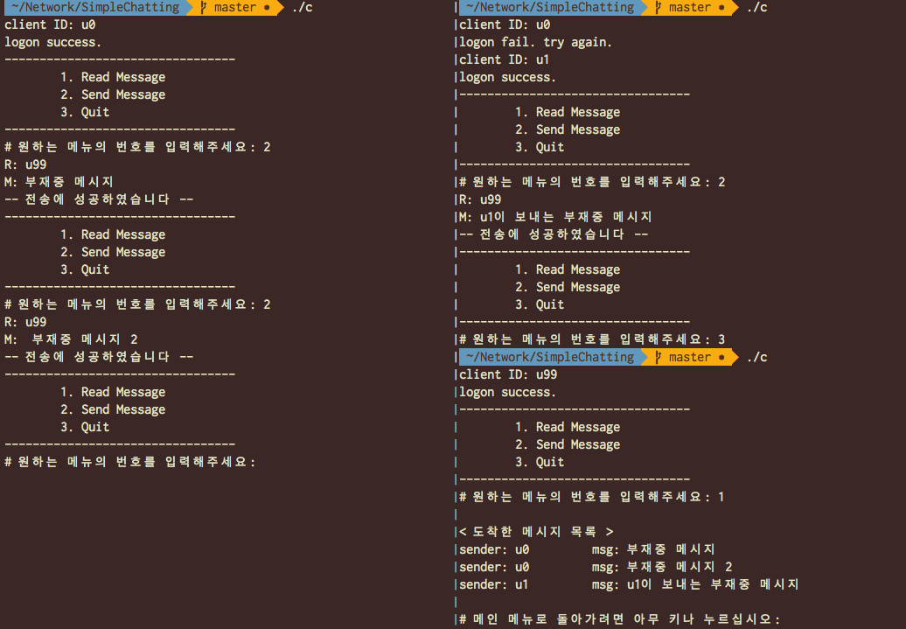
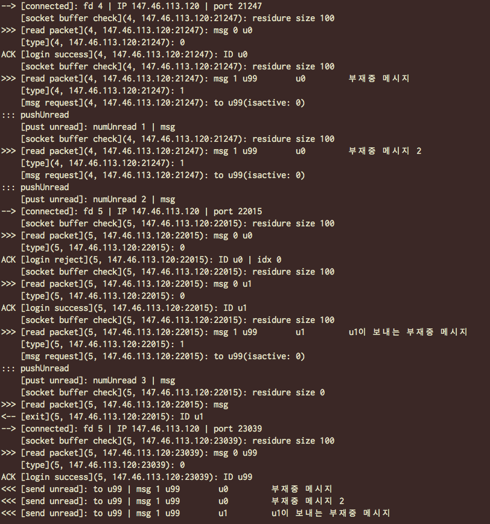

Network Talk
---

> 2016-2 컴퓨터네트워크 HW1<br>

<p align=right>2010-10403 노윤미</p>

## Problem statement

다음과 같은 것을 구현해야 한다.

### Client

1. login<br>
서버에 로그인을 요청한다. 
이때 아이디만을 보내고, 로그인에 성공한 경우 "log on success"라는 메시지가 뜬다.
실패한 경우 "log on denied"라는 메시지가 뜨며 재로그인을 요구한다.
로그인에 성공하면 activate상태가 된다.
1. send msg<br>
보내는 사람을 입력하고, 메시지를 입력하면 전송된다.
1. read msg<br>
"S: sender M: msg text"의 포맷으로 받은 모든 메시지를 출력한다.
이때 메시지는 지난 로그아웃 시점부터 모두 출력한다.

### Server

1. multiplexing<br>
서버는 하나지만 클라이언트는 여럿인 상황이므로, 동시에 여러 클라이언트의 작업을 처리할 수 있어야 한다.
1. activated user list<br>
전체 유저 중 성공적으로 로그인하여 아직 접속을 종료하지 않은 유저들을 따로 관리해야 한다.
접속이 끊기면 즉시 이 목록에서 제외하고, 새로 로그인 하는 경우 다시 목록에 넣는다.
1. undelivered message list<br>
접속이 종료된 이후에 메시지가 도착하면 이것을 다시 리스트로 관리한다.
유저가 로그인하는 즉시 전송해주어 확인할 수 있도록 한다.

## Details of Implementation

### Socket 통신

* TCP에서 메시지 패킷 하나를 한 번에 전해준다는 보장이 없다.
따라서 패킷 길이를 100으로 제한한다.
즉, 모든 패킷은 길이를 100으로 맞추어 보낸다.
이때 다 채우지 못한 패킷의 여분은 `\0`으로 채운다.
구현의 편의를 위하여, 버퍼에 메시지가 길이 100이상 차지 않으면 읽지 않는다.
* 서버는 `cn.snucse.org:20403`에 있다.

### Client

로그인 화면에서 아이디를 입력하여 가입된 아이디인 경우, 성공적으로 접속한다.
그렇지 않은 경우 실패 메시지를 띄우며 다시 아이디를 입력받는다.

로그인에 성공하면 `1. read message`, `2. send message`, `3. quit` 세 개의 메뉴를 출력한다.

1. read message<br>
서버가 보내준 메시지를 시간 순서대로 모두 띄워준다.
이때 메뉴 진입시까지 받은 메시지만을 시간순서대로 띄워준다.
먼저 실행 중 받은 메시지를 queue에서 빼서 디스플레이한다.
그후 소켓 버퍼에 쌓여있는 메시지를 모두 읽어서 디스플레이한다.
1. send message<br>
순차적으로 받는 사람과 메시지를 입력한다.
전송에 성공한 경우 서버에서 ack가 도착한다.
실패한 경우 실패를 알리는 nck가 도착한다.
만약 전송 직후 서버에서 읽어온 메시지가 이것이 아니면,
다른 클라이언트로부터 온 메시지로 판단하고 queue에 집어넣는다.
메시지 전송에 성공한 경우 "[successfully sent message]",
실패한 경우 "[failed to send message]"라는 메시지를 출력한다.
실패한 경우는 서버에서 ack을 보내지 않거나, nck이 온 경우로 가정한다.
입력이 종료되면 성공이든 실패든 메인 메뉴로 돌아간다.
1. quit<br>
소켓을 닫고 프로그램을 종료한다.

### Server

#### 유저 관리

유저의 정보는 struct로 만들어서 리스트로 관리한다. 
전체 유저의 수는 100명이라고 가정한다.
struct의 멤버 변수는 다음과 같다.
* user_ID
* activate 여부
* 부재중 message list
* IP와 port 번호
* 현재 file descriptor 번호(부재중일 경우 -1으로 설정)

#### 응답 과정

* logon
    * 로그인 요청이 들어오면 해당 유저가 가입된 유저인지 조회한다.
가입된 경우, activate 여부가 false일 때만 로그인을 허용한다.
가입되지 않았거나 activate된 경우 로그인을 불허한다.
    * 로그인 된 즉시 해당 유저의 정보 중 activate를 true로 바꾸어준다.
* 메시지 보내기
    * 송신자가 올바른 수신자 아이디를 기재하였을 경우 메시지를 받아서 전송해준다.
올바른 아이디가 아닌 경우, 실패했다는 알림을 송신자에게 다시 보내준다.
올바른 아이디인 경우, 성공했다는 알림을 송신자에게 전송한다.
이때, 실제로 수신자에게 서버가 메시지를 보낸 것이 아니어도 알림을 보낸다.
즉 서버에 잘 도착했다는 의미의 ack이다.
    * 수신자가 active한 경우, 즉시 메시지를 전송해준다.
로그아웃중인 경우, 메시지를 부재중 message list에 쌓아두었다가 로그인한 즉시 전부 보내준다.

#### 멀티플렉싱

한 클라이언트와 소통하는 것이 아니므로, 비동기 처리 혹은 멀티플렉싱 등의 방법을 써야 한다.
이 프로그램에서는 select 함수를 사용한 멀티플렉싱을 한다.
select는 파일 디스크립트를 이용하여 멀티플렉스를 할 수 있도록 돕는다.
파일 디스크립터를 순차적으로 돌아가면서, 변화가 감지되면 그 변화를 처리한다.


#### 로깅

기본적으로 로그를 다음과 같이 보여준다.
```
상태 [처리 프로세스](file descriptor번호, IP:port): 상세 설명
```
이때 상태는 다음과 같이 나뉜다.

1. `>>> `: 메시지 들어옴
1. `<<< `: 메시지 보냄
1. `::: `: 메시지 보류
1. `ACK `: ack 보냄
1. `--> `: 소켓 연결됨
1. `<-- `: 소켓 연결 종료
1. `    `: 내부 처리

### Protocol

서버와 클라이언트 간 주고받는 메시지는 다음과 같이 구성된다.

`코드번호|요소1|요소2|...`

메시지는 한번에 하나의 `char` 배열로 전달된다.
요소는 메시지 타입에 따라서 서로 다르다(아래 항목에서 상술).
각 요소의 구분은 공백으로 이루어진다.
예컨대 유저 `User1`의 로그인 요청은 다음과 같을 것이다.
`0 User1`

한편, 편의를 위하여 패킷 사이즈는 100byte로 제한한다.
코드번호 뒤에 메시지의 길이를 준 뒤,
메시지 크기를 가변으로 받을 수도 있으나 간단한 채팅 프로그램으로 긴 메시지가 거의 오가지 않는다고 가정하면 패킷 사이즈를 제한하는 것이 유의미하게 비효율적이지는 않을 것이다.

패킷 사이즈 제한을 위해서 유저가 보내는 메시지의 길이는 최대 75자로 제한한다.
ID의 길이는 최대 10자이다.

#### Client to Server

* login request(0)
    * 서버에 로그인을 요청한다.
    * `0 ID`
* send message(1)
    * sender에게 message 전송 요청을 한다.
    * `1 receiver sender message`

#### Server to Client

* login accept/reject(0)
    * 서버에서 로그인을 accept하거나 reject한다.
    * rejected: `0 0`
    * accepted: `0 1`
* deliver message(1)
    * 유저에게 온 메시지를 전달해준다. 유저가 로그아웃 중일 경우 메시지를 보관해 두었다가, 로그인 하는 순간 전달해준다.
    * `1 receiver sender message`
* ack(2)
    * 유저가 전송한 메시지를 성공적으로 받았음을 알린다. 이때 존재하는 유저에게 전송한 경우(success)와 그렇지 않은 경우(fail)로 나뉜다.
    * fail: `2 0`
    * success: `2 1`

## Result



* 위에서 u0으로 먼저 로그인 한 뒤, 다른 세션에서 다시 u0으로 로그인 하려고 하여 로그인이 거부되었다.
* u99가 로그인 하기 전 u0과 u1이 보낸 메시지가 모두 u99에게 순서대로 도착하였다.



* 위 작업에 대한 서버의 로그이다.


## Discussion

### 패킷 사이즈 지정

가변 길이로 하는 것이 효율이 더 좋을 수 있다.
현재 코드에서는 패킷 길이가 100이라고 가정하고 있다.
이 경우 긴 메시지를 보낼 수 없다.
또한 ack를 보낼 때도 100짜리 패킷을 쓰고 있어서 통신에 시간이 낭비되고 있다.

가변 길이 패킷을 만들기 위하여 패킷 코드 뒤 혹은 앞에 패킷 사이즈를 부착하는 방식으로 구현이 가능하다.
이 경우 패킷을 받았을 때 모두 받은 것이 아니라 일부만 받은 것이 밝혀진다면,
클라이언트마다 미리 버퍼를 만들어 두었다가 거기에 넣어둔다.
그 후 한 패킷이 모두 받아졌을 때 그 처리를 시작하면 된다.

### 비동기 처리

현재 코드는 select 함수를 사용한 멀티플렉싱을 하고 있다.
그러나 서버에서 많은 연산을 해야 하는 경우,
select 함수에서 대기하는 것이 비효율적이다.
이 경우에는 비동기적으로 메시지를 처리하는 것이 좋다.

그러나 숙제에서는 서버와 클라이언트 소수의 통신만을 하므로,
비동기 처리까지는 구현하지 않아도 되었다.
